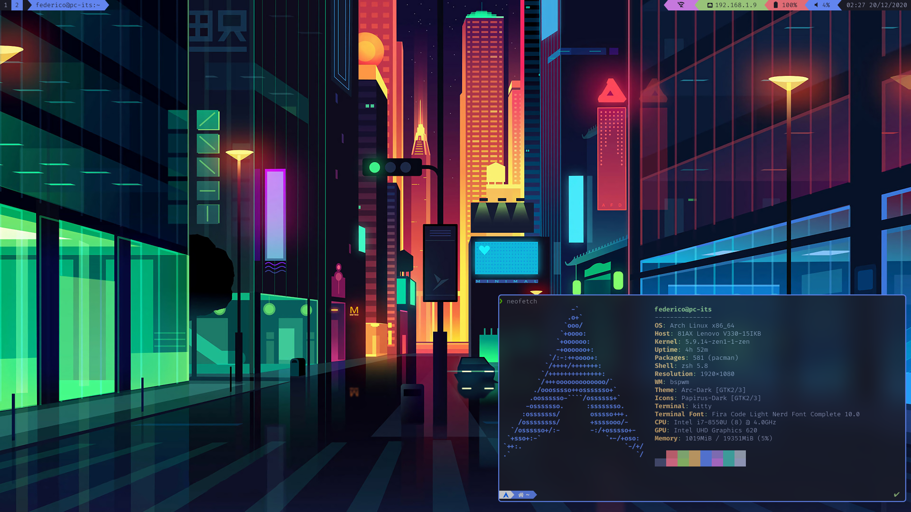

# Tokyonight bspwm

> **Disclaimer:** This is not meant to be a Cyberpunk theme (as someone has told me)

## Overview
| Category | Name |
| :-- | :-- |
| OS | Arch Linux |
| WM | bspwm |
| Bar | Polybar |
| Editor | Neovim |
| Terminal | Kitty |
| Theme | Tokyonight |
| Shell | Zsh + Powerlevel10k |
| Compositor | Picom (Jonaburg's fork) |

## Dotscript
Dependencies:
- brightnessctl
- nmcli
- polybar
- bspwm/bspc

Other dependencies:
- pulseaudio + pulsemixer
- flameshot
- oh-my-zsh

## ZSH
ZSH config files are inside the `.config` folder so make sure to set `$ZDOTDIR` to the path in which you wish to save your zsh's config files.
> **e.g.**: `ZDOTDIR=/home/youruser/.config/zsh` in your `.profile` file

## NeoVim
Checkout [my nvim-config repository](https://github.com/FedericoAntoniazzi/nvim-config).

## Credits
- [Ghifarit53](https://github.com/ghifarit53) for [tokyonight-vim](https://github.com/ghifarit53/tokyonight-vim)
- A random wallpaper found by chance but I don't know the author
